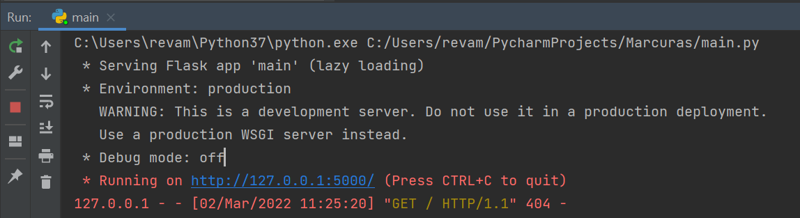
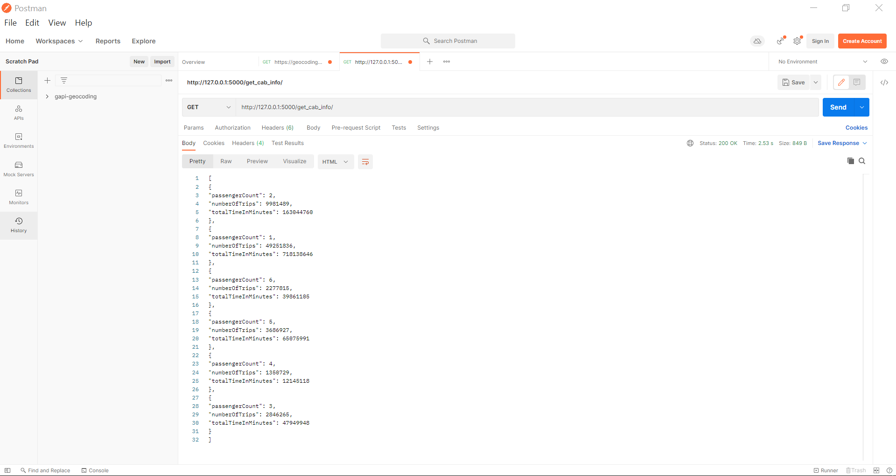

# Marcura-Deng-CaseStudy
Case study for Data Engineering Role on Yellow Cabs Opensource data.

Solution Stack:

* Programming Language Used: Python
* Python Modules Used: Google Cloud BQ, pandas, flask

Result:
* Flask APP started Running on http://127.0.0.1:5000/

* Json object with the aggregated results is returned for GET request.

Performance:

* Returns result in less than 3s

Note: For numberOfCabsRequired field. There is no sufficient information provided on the requirements.